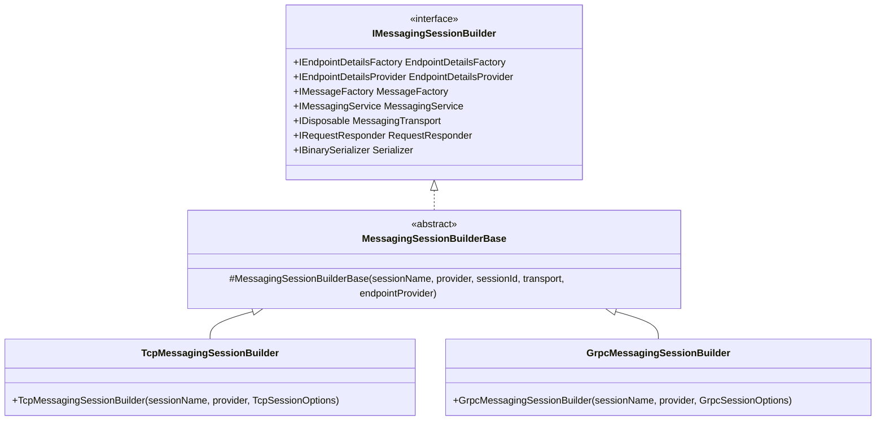
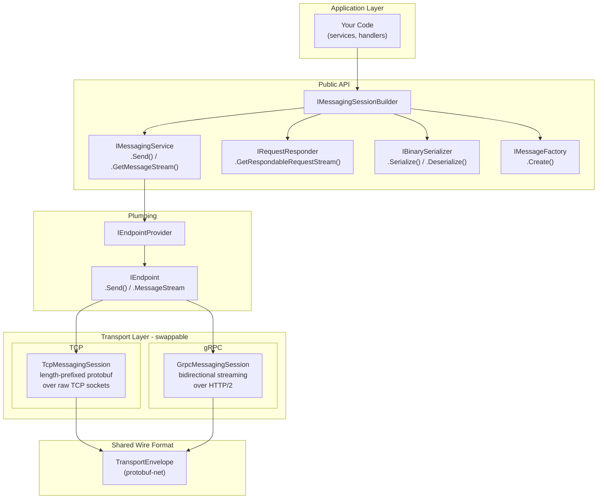
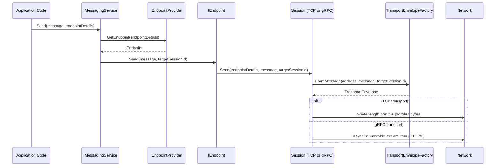
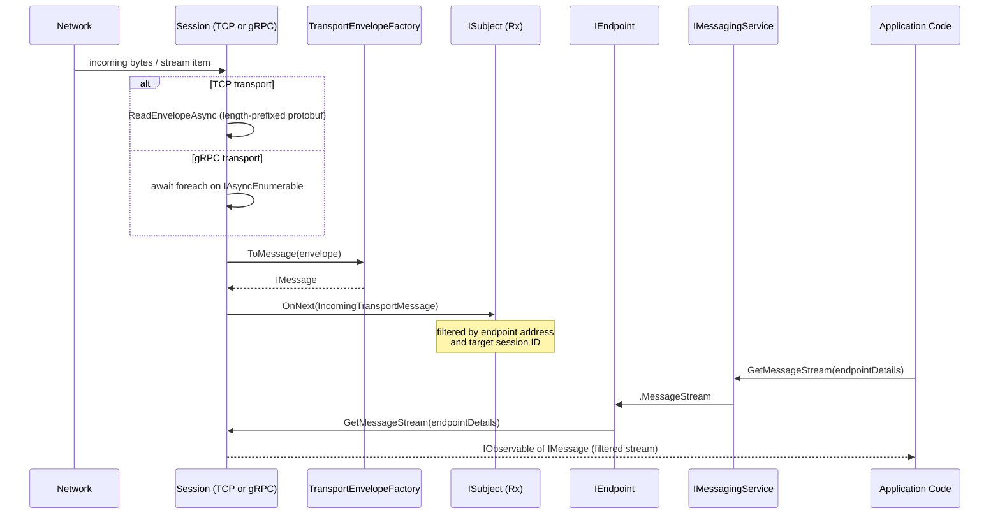
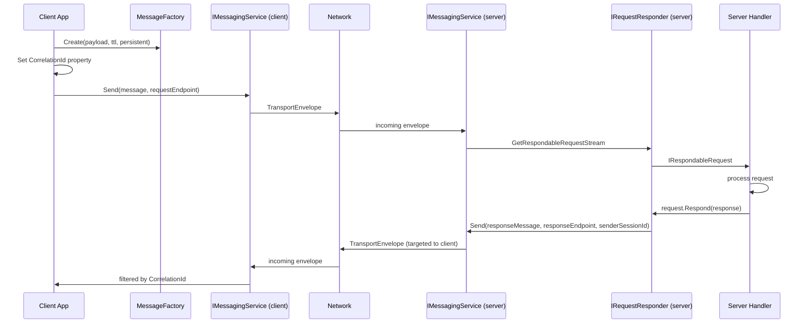
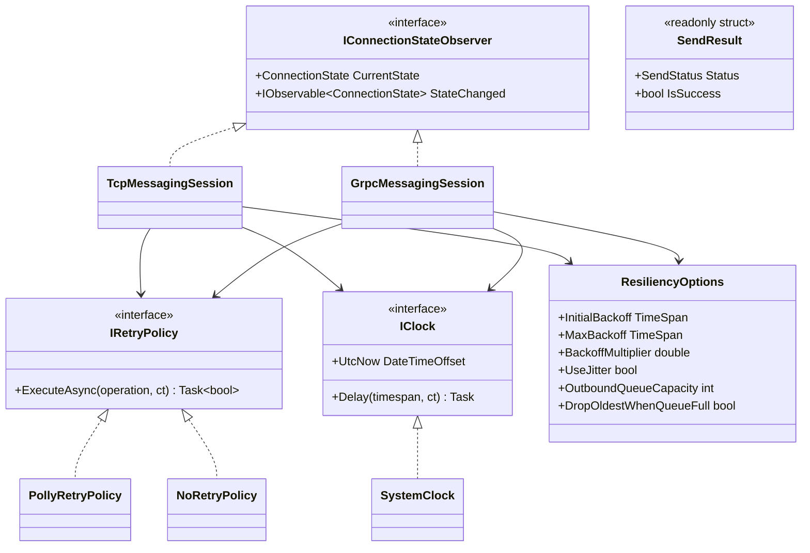
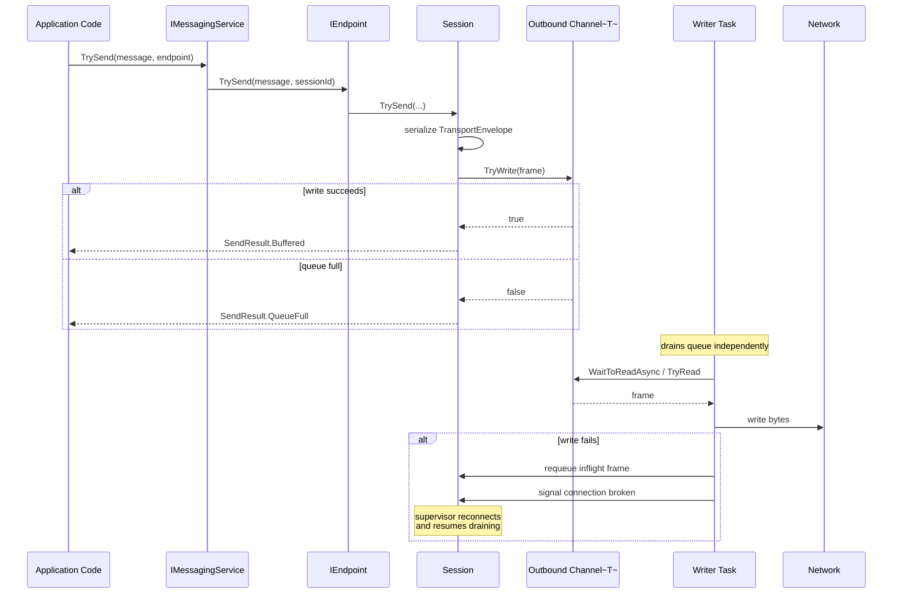
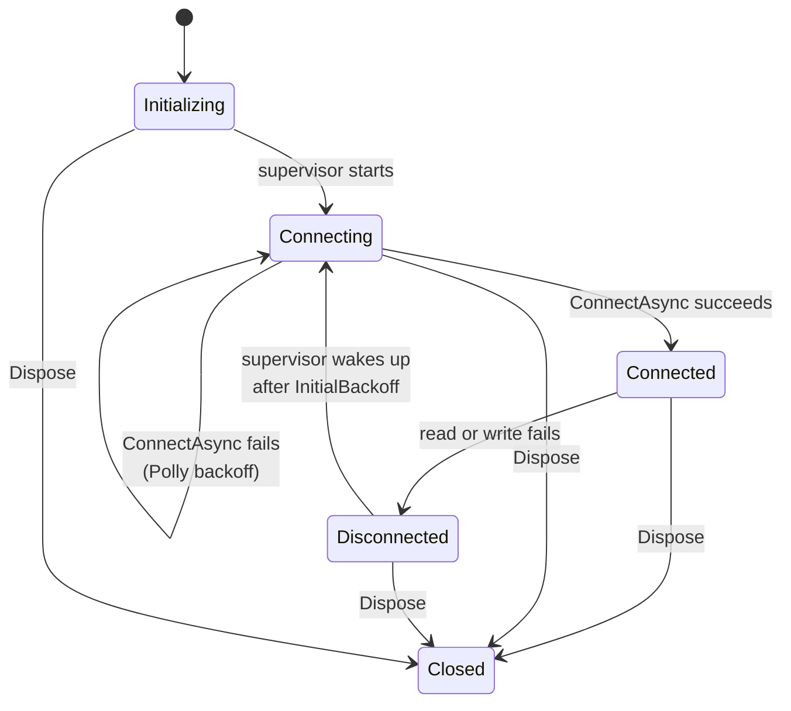

# Architecture

This document describes the internal architecture of Dcs.Messaging, with diagrams illustrating how the components fit together.

## Builder Class Hierarchy

Applications create a session by instantiating a transport-specific builder. Both builders produce an `IMessagingSessionBuilder` with an identical API surface, so all downstream code is transport-agnostic.



The abstract base class (`MessagingSessionBuilderBase`) wires the common services:

- `MessageEndpointDetailsFactory` -- creates endpoint detail objects
- `MessageFactory` -- creates `IMessage` instances stamped with the session ID
- `ProtobufNetBinarySerializer` -- protobuf-net based binary serializer
- `MessagingService` -- routes send/receive through the endpoint provider
- `RequestResponder` -- request/response correlation layer

Each concrete builder only needs to create its transport session and endpoint provider, then pass them to the base constructor.

---

## Internal Layering

The framework is structured in layers. Application code interacts with the public API; the transport layer is pluggable underneath.



### Key interfaces

| Interface | Responsibility |
|-----------|---------------|
| `IMessagingSessionBuilder` | Entry point. Provides all services needed by application code. |
| `IMessagingService` | Send messages to and receive message streams from logical endpoints. |
| `IRequestResponder` | Higher-level request/response pattern with automatic correlation. |
| `IBinarySerializer` | Serialize/deserialize application payloads (protobuf-net). |
| `IMessageFactory` | Create `IMessage` instances with session identity and properties. |
| `IEndpointProvider` | Map `IEndpointDetails` to `IEndpoint` instances (transport-specific). |
| `IEndpoint` | Low-level send/receive on a single logical endpoint within a session. |

---

## Message Send Flow

When application code calls `MessagingService.Send()`, the message travels through these layers:



### Targeting

- If `targetSessionId` is set, the message is delivered only to the connection whose remote session matches that ID.
- If `targetSessionId` is null/empty and the sender is a **server**, the message is broadcast to all connected clients.
- If the sender is a **client**, messages go to the single server connection.

---

## Message Receive Flow

Incoming messages are deserialized by the session, filtered by endpoint address and target session ID, and pushed into an Rx `ISubject`. Application code subscribes via `GetMessageStream()`.



---

## Request/Response Pattern

The `IRequestResponder` provides a higher-level abstraction over send/receive for correlated request/response flows.



### How it works

1. The **client** creates a message, stamps it with a `CorrelationId` property, and sends it to the request endpoint.
2. The **server** subscribes to `IRequestResponder.GetRespondableRequestStream<TReq, TRes>(requestEndpoint, responseEndpoint)`. Each incoming request is exposed as an `IRespondableRequest<TReq, TRes>`.
3. The server handler calls `request.Respond(response)`, which serializes the response, stamps it with the same `CorrelationId`, and sends it back via the response endpoint targeted to the original sender's session ID.
4. The **client** filters incoming messages on the response endpoint by `CorrelationId` to match the reply.

---

## Wire Format: TransportEnvelope

Both TCP and gRPC use the same protobuf-serialized envelope (`TransportEnvelope`):

| ProtoMember | Field | Type | Description |
|-------------|-------|------|-------------|
| 1 | `EndpointAddress` | `string` | Logical endpoint the message belongs to |
| 2 | `SenderSessionId` | `string` | Session ID of the sender |
| 3 | `TargetSessionId` | `string` | If set, message is delivered only to this session |
| 4 | `Tag` | `string` | Optional message tag |
| 5 | `Properties` | `List<TransportPropertyValue>` | Key-value metadata (correlation ID, TTL, etc.) |
| 6 | `Payload` | `byte[]` | Serialized application payload |

Each `TransportPropertyValue` carries a `Key`, `Kind` (bool/double/int/string), and the corresponding typed value field. This allows message properties to round-trip across the wire without losing type information.

### TCP framing

```
[4 bytes: big-endian int32 payload length][N bytes: protobuf-serialized TransportEnvelope]
```

### gRPC framing

The `TransportEnvelope` is sent as individual items in a bidirectional `IAsyncEnumerable<TransportEnvelope>` stream. HTTP/2 handles framing.

---

## Endpoint Configuration

Endpoints are logical channels identified by string keys. An `IEndpointDetailsProvider` maps keys to `IEndpointDetails` objects (address + type).

The sample apps use `TestEndpointDetailsProvider` with three pre-configured endpoints:

| Key | Address | Used for |
|-----|---------|----------|
| `TEST_ALERTS` | `Test/Alerts` | Server broadcasts alert messages (pub/sub) |
| `TEST_PRICING_REQUESTS` | `Test/Pricing/Requests` | Client sends pricing requests |
| `TEST_PRICING_RESPONSES` | `Test/Pricing/Responses` | Server sends pricing responses back |

To add your own endpoints, implement `IEndpointDetailsProvider` or extend `TestEndpointDetailsProvider`.

---

## Adding a New Transport

The framework is designed to be extensible. To add a new transport (e.g. WebSocket, named pipes):

1. Create a new session class (like `TcpMessagingSession` or `GrpcMessagingSession`) that implements `IDisposable` and exposes `GetMessageStream()` and `Send()` methods.
2. Create a matching `IEndpointProvider` and `IEndpoint` implementation.
3. Create a new builder class extending `MessagingSessionBuilderBase`, passing your session and endpoint provider to the base constructor.

No existing code needs to change -- the Open/Closed principle is preserved by the builder hierarchy.

For resiliency, accept `IRetryPolicy` and `IClock` parameters in your session
constructor and use the same outbound-queue + supervisor pattern described
below.

---

## Resiliency

Both transports share the same resiliency model: a persistent outbound queue,
an automatic reconnect supervisor (client mode only), and structured
`SendResult` outcomes instead of exceptions.

### Component diagram



### Send pipeline (no-throw)



### Client reconnect supervisor



The supervisor loop is:

1. Set state `Connecting`.
2. Call `IRetryPolicy.ExecuteAsync` &mdash; the policy retries the connect
   attempt with exponential backoff until it succeeds or the session is
   cancelled.
3. Once connected, set state `Connected` and create a write loop that drains
   the **persistent** outbound queue.
4. If the write loop reports a transport failure, the in-flight frame is
   stored on the session and prepended to the next connection's writer. The
   supervisor then waits one `InitialBackoff` interval and starts again.
5. On `Dispose`, all loops are cancelled and the supervisor exits within the
   5-second drain timeout.

### Send-result mapping

| `SendStatus`     | When                                                                                  |
|------------------|---------------------------------------------------------------------------------------|
| `Sent`           | (Reserved for future synchronous-write fast paths.)                                   |
| `Buffered`       | The frame was successfully placed in the outbound queue.                              |
| `QueueFull`      | The outbound queue was full and `DropOldestWhenQueueFull` is `false`.                 |
| `NoSuchTarget`   | Server-side send: no connection matched the requested target session ID, or no clients are connected for a broadcast. |
| `ShuttingDown`   | The session has been disposed (or is in the process of disposing).                    |

### Why no `IObservable<Unit>` for resilient sends

The legacy `IMessagingService.Send(...)` returns an `IObservable<Unit>` whose
factory is scheduled on `Scheduler.Default`. That keeps the historical API
compatible but means a tight loop of `Send` calls can be reordered by the
thread pool. For ordering-sensitive code, use `IMessagingService.TrySend(...)`
which writes to the outbound queue synchronously on the calling thread.
