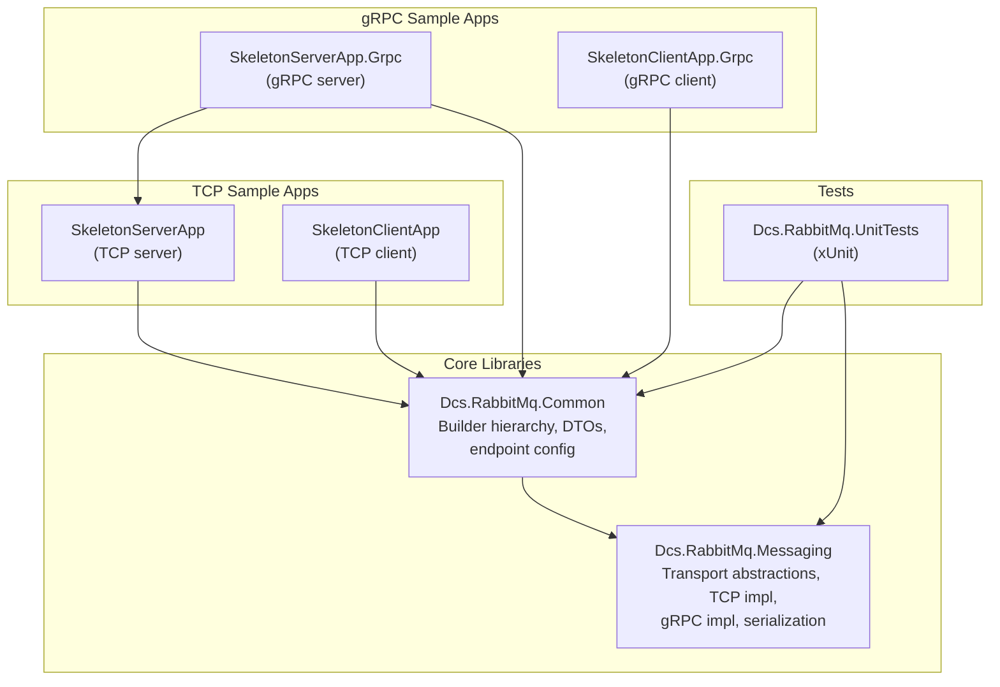

# Dcs.RabbitMq Messaging Framework

A protocol-agnostic messaging framework for .NET that supports **TCP** and **gRPC** transports with a unified API. Application code is written against abstractions; switching transport is a one-line builder change.

## Table of Contents

- [Solution Structure](#solution-structure)
- [Architecture Overview](#architecture-overview)
- [Getting Started](#getting-started)
- [Transports](#transports)
- [Running the Samples](#running-the-samples)

---

## Solution Structure



| Project | Description |
|---------|-------------|
| **Dcs.RabbitMq.Messaging** | Core library: transport abstractions (`IMessagingService`, `IEndpoint`, `IEndpointProvider`), TCP and gRPC session implementations, protobuf serialization, shared `TransportEnvelope` wire format. |
| **Dcs.RabbitMq.Common** | Composition root: `IMessagingSessionBuilder` interface, `MessagingSessionBuilderBase` abstract class, `TcpMessagingSessionBuilder`, `GrpcMessagingSessionBuilder`, DTOs, and endpoint configuration. |
| **Dcs.RabbitMq.SkeletonServerApp** | Sample TCP server demonstrating alerts (pub/sub) and pricing (request/response). |
| **Dcs.RabbitMq.SkeletonClientApp** | Sample TCP client that subscribes to alerts and requests pricing. |
| **Dcs.RabbitMq.SkeletonServerApp.Grpc** | Same server functionality over gRPC. Reuses the service classes from the TCP server project. |
| **Dcs.RabbitMq.SkeletonClientApp.Grpc** | Same client functionality over gRPC. |
| **Dcs.RabbitMq.UnitTests** | xUnit tests covering transport types, serialization, and builder wiring. |

---

## Architecture Overview

See [ARCHITECTURE.md](ARCHITECTURE.md) for detailed diagrams covering:

- Builder class hierarchy
- Internal layering and message flow
- Send and receive sequences
- Request/response pattern

---

## Getting Started

### Prerequisites

- .NET 10.0 SDK or later

### Building

```bash
dotnet build Dcs.RabbitMq.sln
```

### Running Tests

```bash
dotnet test Dcs.RabbitMq.sln
```

### Quick Start (TCP)

**Server:**

```csharp
var endpointProvider = new TestEndpointDetailsProvider();
var serverId = Guid.NewGuid().ToString();
var options = TcpSessionOptions.CreateServer("127.0.0.1", 5050, serverId);
var builder = new TcpMessagingSessionBuilder("MyServer", endpointProvider, options);

using (builder.MessagingTransport)
{
    // Use builder.MessagingService to send/receive
    // Use builder.RequestResponder for request/response
    Console.ReadLine();
}
```

**Client:**

```csharp
var endpointProvider = new TestEndpointDetailsProvider();
var clientId = Guid.NewGuid().ToString();
var options = TcpSessionOptions.CreateClient("127.0.0.1", 5050, clientId);
var builder = new TcpMessagingSessionBuilder("MyClient", endpointProvider, options);

using (builder.MessagingTransport)
{
    // Use builder.MessagingService to send/receive
    Console.ReadLine();
}
```

### Quick Start (gRPC)

The only change is the builder and options type:

**Server:**

```csharp
var options = GrpcSessionOptions.CreateServer("http://127.0.0.1:5050", serverId);
var builder = new GrpcMessagingSessionBuilder("MyServer", endpointProvider, options);
```

**Client:**

```csharp
var options = GrpcSessionOptions.CreateClient("http://127.0.0.1:5050", clientId);
var builder = new GrpcMessagingSessionBuilder("MyClient", endpointProvider, options);
```

All downstream code (`MessagingService`, `RequestResponder`, `Serializer`, etc.) is identical regardless of transport.

---

## Transports

### TCP

- Uses raw TCP sockets with a **4-byte big-endian length prefix** followed by protobuf-serialized `TransportEnvelope` bytes.
- Server binds to `host:port` and accepts multiple client connections.
- Client connects to a single server endpoint.
- Configure via `TcpSessionOptions.CreateServer(host, port, sessionId)` / `TcpSessionOptions.CreateClient(host, port, sessionId)`.

### gRPC

- Uses **protobuf-net.Grpc** (code-first) with a single **bidirectional streaming** RPC (`Exchange`).
- Server runs an embedded **Kestrel** HTTP/2 host via `WebApplication`.
- Client connects via `GrpcChannel.ForAddress`.
- For local development without TLS, HTTP/2 cleartext (h2c) is enabled by default (`EnableHttp2Unencrypted = true` on options).
- Configure via `GrpcSessionOptions.CreateServer(baseUrl, sessionId)` / `GrpcSessionOptions.CreateClient(baseUrl, sessionId)`.

---

## Running the Samples

### TCP pair

In two separate terminals:

```bash
# Terminal 1 - Server
dotnet run --project Dcs.RabbitMq.SkeletonServerApp

# Terminal 2 - Client
dotnet run --project Dcs.RabbitMq.SkeletonClientApp
```

### gRPC pair

```bash
# Terminal 1 - Server
dotnet run --project Dcs.RabbitMq.SkeletonServerApp.Grpc

# Terminal 2 - Client
dotnet run --project Dcs.RabbitMq.SkeletonClientApp.Grpc
```

> **Note:** Both TCP and gRPC samples default to port 5050. Do not run a TCP server and gRPC server simultaneously on the same port.
