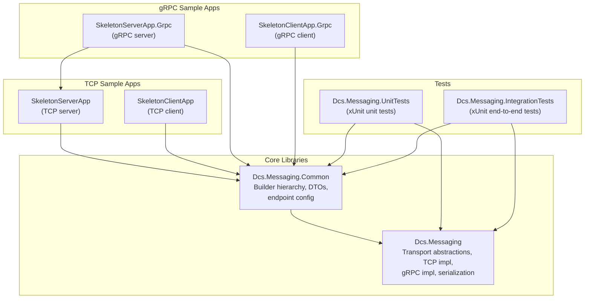

# Dcs.Messaging

Dcs.Messaging is a protocol-agnostic .NET messaging framework that supports **TCP** and **gRPC** transports with a unified API. Application code is written against abstractions; switching transport is a one-line builder change.

## Table of Contents

- [Solution Structure](#solution-structure)
- [Namespace Overview](#namespace-overview)
- [Architecture Overview](#architecture-overview)
- [Getting Started](#getting-started)
- [Transports](#transports)
- [Running the Samples](#running-the-samples)

---

## Solution Structure



| Project | Description |
|---------|-------------|
| **Dcs.Messaging** | Core library: transport abstractions (`IMessagingService`, `IEndpoint`, `IEndpointProvider`), TCP and gRPC session implementations, protobuf serialization, shared `TransportEnvelope` wire format. |
| **Dcs.Messaging.Common** | Composition root: `IMessagingSessionBuilder` interface, `MessagingSessionBuilderBase` abstract class, `TcpMessagingSessionBuilder`, `GrpcMessagingSessionBuilder`, DTOs, and endpoint configuration. |
| **Dcs.Messaging.SkeletonServerApp** | Sample TCP server demonstrating alerts (pub/sub) and pricing (request/response). |
| **Dcs.Messaging.SkeletonClientApp** | Sample TCP client that subscribes to alerts and requests pricing. |
| **Dcs.Messaging.SkeletonServerApp.Grpc** | Same server functionality over gRPC. Reuses the service classes from the TCP server project. |
| **Dcs.Messaging.SkeletonClientApp.Grpc** | Same client functionality over gRPC. |
| **Dcs.Messaging.UnitTests** | xUnit unit tests covering transport types, serialization, and builder wiring. |
| **Dcs.Messaging.IntegrationTests** | xUnit end-to-end tests for TCP and gRPC: real sockets / Kestrel, reconnection scenarios, send-result semantics, and DI extensions. |

---

## Namespace Overview

| Namespace | Purpose |
|-----------|---------|
| `Dcs.Messaging` | Core public abstractions and shared message types, including `IMessagingService`, `IMessage`, `IEndpoint`, `IEndpointDetails`, `MessageFactory`, and `TransportPropertyKeys`. |
| `Dcs.Messaging.Tcp` | TCP transport sessions, endpoints, endpoint providers, and TCP session options. |
| `Dcs.Messaging.Grpc` | gRPC transport sessions, endpoint providers, service contracts, and gRPC session options. |
| `Dcs.Messaging.RequestResponse` | Request/response correlation interfaces and responder implementation. |
| `Dcs.Messaging.Serialization` | Binary serializer abstractions and protobuf-net serializer. |
| `Dcs.Messaging.Resiliency` | Resiliency primitives: `IRetryPolicy`, `PollyRetryPolicy`, `IClock`, `ResiliencyOptions`, `SendResult`, `ConnectionState`, `IConnectionStateObserver`. |
| `Dcs.Messaging.ServiceModel` | Attribute-based service model helpers. |
| `Dcs.Messaging.Commanding` | Command stream abstractions. |
| `Dcs.Messaging.Common` | Sample composition helpers, builders, DTOs, and endpoint configuration used by the skeleton apps. |
| `Dcs.Messaging.Common.DependencyInjection` | `IServiceCollection` extension methods (`AddDcsTcpMessaging`, `AddDcsGrpcMessaging`, `AddDcsMessagingResiliency`). |

---

## Architecture Overview

See [ARCHITECTURE.md](ARCHITECTURE.md) for detailed diagrams covering:

- Builder class hierarchy
- Internal layering and message flow
- Send and receive sequences
- Request/response pattern

---

## Getting Started

### Prerequisites

- .NET 10.0 SDK or later

### Building

```bash
dotnet build Dcs.Messaging.sln
```

### Running Tests

```bash
# Both unit and integration tests
dotnet test Dcs.Messaging.sln

# Just unit tests (fast)
dotnet test Dcs.Messaging.UnitTests/Dcs.Messaging.UnitTests.csproj

# Just integration tests (boots real TCP / Kestrel; ~25 s)
dotnet test Dcs.Messaging.IntegrationTests/Dcs.Messaging.IntegrationTests.csproj
```

### Quick Start (TCP)

**Server:**

```csharp
var endpointProvider = new TestEndpointDetailsProvider();
var serverId = Guid.NewGuid().ToString();
var options = TcpSessionOptions.CreateServer("127.0.0.1", 5050, serverId);
var builder = new TcpMessagingSessionBuilder("MyServer", endpointProvider, options);

using (builder.MessagingTransport)
{
    // Use builder.MessagingService to send/receive
    // Use builder.RequestResponder for request/response
    Console.ReadLine();
}
```

**Client:**

```csharp
var endpointProvider = new TestEndpointDetailsProvider();
var clientId = Guid.NewGuid().ToString();
var options = TcpSessionOptions.CreateClient("127.0.0.1", 5050, clientId);
var builder = new TcpMessagingSessionBuilder("MyClient", endpointProvider, options);

using (builder.MessagingTransport)
{
    // Use builder.MessagingService to send/receive
    Console.ReadLine();
}
```

### Quick Start (gRPC)

The only change is the builder and options type:

**Server:**

```csharp
var options = GrpcSessionOptions.CreateServer("http://127.0.0.1:5050", serverId);
var builder = new GrpcMessagingSessionBuilder("MyServer", endpointProvider, options);
```

**Client:**

```csharp
var options = GrpcSessionOptions.CreateClient("http://127.0.0.1:5050", clientId);
var builder = new GrpcMessagingSessionBuilder("MyClient", endpointProvider, options);
```

All downstream code (`MessagingService`, `RequestResponder`, `Serializer`, etc.) is identical regardless of transport.

### Quick Start with `IServiceCollection`

For applications that already use Microsoft.Extensions.DependencyInjection, register the framework directly:

```csharp
var services = new ServiceCollection();

services.AddDcsMessagingResiliency(new ResiliencyOptions
{
    InitialBackoff = TimeSpan.FromMilliseconds(250),
    MaxBackoff = TimeSpan.FromSeconds(30),
    OutboundQueueCapacity = 8192,
});

services.AddDcsTcpMessaging(
    sessionName: "MyClient",
    endpointDetailsProvider: new TestEndpointDetailsProvider(),
    sessionOptions: TcpSessionOptions.CreateClient("127.0.0.1", 5050, clientId));

await using var provider = services.BuildServiceProvider();
var messaging = provider.GetRequiredService<IMessagingService>();
var responder = provider.GetRequiredService<IRequestResponder>();
```

The DI extensions register `IRetryPolicy`, `IClock`, the transport-specific session
builder, and all common abstractions (`IMessagingService`, `IRequestResponder`,
`IBinarySerializer`, `IMessageFactory`, `IEndpointDetailsFactory`,
`IEndpointDetailsProvider`).

---

## Resiliency

The framework is **resilient by default** &mdash; both transports survive
network blips without throwing across the API boundary.

### What you get out of the box

- **Automatic client reconnect** &mdash; client-mode TCP and gRPC sessions
  reconnect with exponential backoff (default 250 ms &rarr; 30 s, ~2&times;
  multiplier, jitter on). Powered by Polly v8 under
  `Dcs.Messaging.Resiliency.PollyRetryPolicy`.
- **Send while disconnected** &mdash; sends are buffered into a per-connection
  bounded `Channel<T>` (default capacity 8192) and flushed once the connection
  is up. The synchronous `IMessagingService.TrySend(...)` returns a
  `SendResult` (`Buffered`, `Sent`, `QueueFull`, `NoSuchTarget`,
  `ShuttingDown`) instead of throwing.
- **In-flight message preservation** &mdash; if a write fails partway through,
  the pending frame is re-enqueued at the head of the next connection's queue
  so a single drop does not lose the message.
- **Few exceptions on the hot path** &mdash; transport failures map to status
  codes; only programmer errors and shutdown still throw.
- **Observable connection state** &mdash; both sessions implement
  `IConnectionStateObserver` so applications can watch
  `Initializing &rarr; Connecting &rarr; Connected &rarr; Disconnected &rarr; Closed`.

### Tuning

Set a `ResiliencyOptions` on the session options:

```csharp
var options = TcpSessionOptions.CreateClient("127.0.0.1", 5050, clientId);
options.Resiliency = new ResiliencyOptions
{
    InitialBackoff = TimeSpan.FromMilliseconds(100),
    MaxBackoff = TimeSpan.FromSeconds(5),
    BackoffMultiplier = 2.0,
    UseJitter = true,
    OutboundQueueCapacity = 16_384,
    DropOldestWhenQueueFull = false,
};
```

### Synchronous, allocation-free send

```csharp
var result = messagingService.TrySend(message, endpoint);
if (!result.IsSuccess)
{
    // result.Status is one of QueueFull / NoSuchTarget / ShuttingDown
    metrics.RecordDroppedMessage(result.Status);
}
```

Prefer `TrySend` over `Send` when you need ordering guarantees: `Send` returns
an `IObservable<Unit>` whose factory is scheduled on the thread pool, so a
tight loop of `Send` calls can be reordered. `TrySend` enqueues synchronously.

### Observing reconnects

```csharp
var session = ((TcpMessagingSessionBuilder)builder).Session;
session.StateChanged.Subscribe(state =>
    Console.WriteLine($"Connection state -> {state}"));
```

---

## Transports

### TCP

- Uses raw TCP sockets with a **4-byte big-endian length prefix** followed by protobuf-serialized `TransportEnvelope` bytes.
- Server binds to `host:port` and accepts multiple client connections.
- Client connects to a single server endpoint.
- Configure via `TcpSessionOptions.CreateServer(host, port, sessionId)` / `TcpSessionOptions.CreateClient(host, port, sessionId)`.

### gRPC

- Uses **protobuf-net.Grpc** (code-first) with a single **bidirectional streaming** RPC (`Exchange`).
- Server runs an embedded **Kestrel** HTTP/2 host via `WebApplication`.
- Client connects via `GrpcChannel.ForAddress`.
- For local development without TLS, HTTP/2 cleartext (h2c) is enabled by default (`EnableHttp2Unencrypted = true` on options).
- Configure via `GrpcSessionOptions.CreateServer(baseUrl, sessionId)` / `GrpcSessionOptions.CreateClient(baseUrl, sessionId)`.

---

## Running the Samples

### TCP pair

In two separate terminals:

```bash
# Terminal 1 - Server
dotnet run --project Dcs.Messaging.SkeletonServerApp

# Terminal 2 - Client
dotnet run --project Dcs.Messaging.SkeletonClientApp
```

### gRPC pair

```bash
# Terminal 1 - Server
dotnet run --project Dcs.Messaging.SkeletonServerApp.Grpc

# Terminal 2 - Client
dotnet run --project Dcs.Messaging.SkeletonClientApp.Grpc
```

> **Note:** Both TCP and gRPC samples default to port 5050. Do not run a TCP server and gRPC server simultaneously on the same port.
